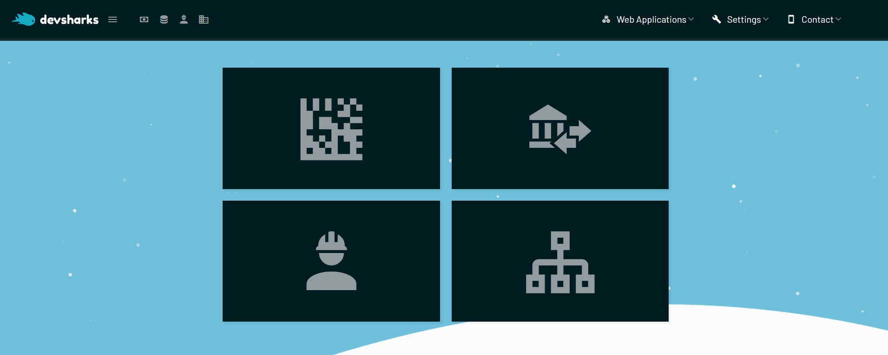
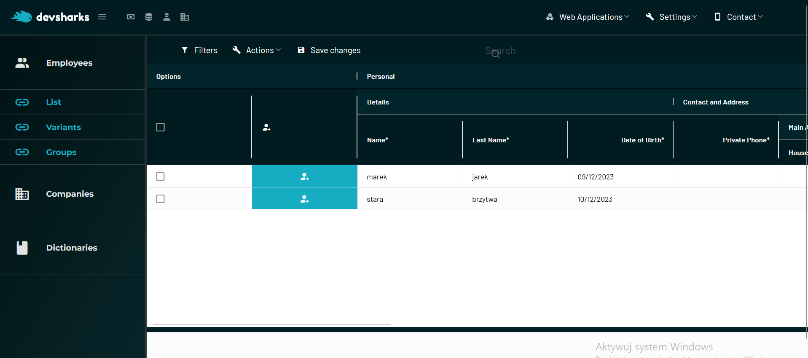
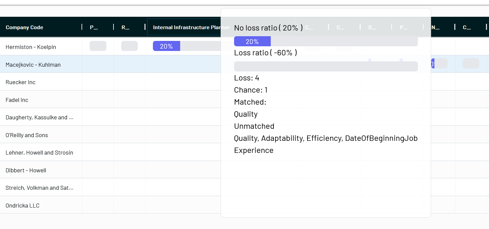
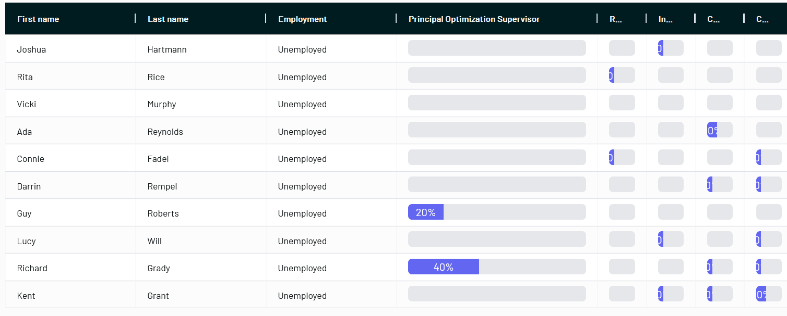
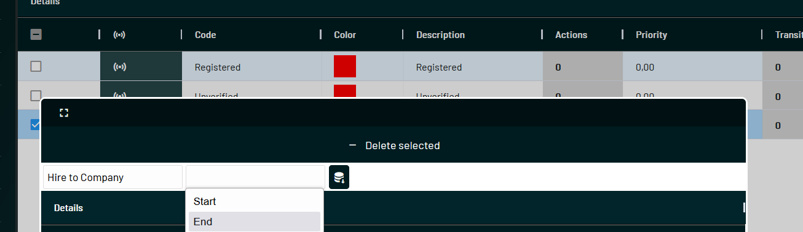
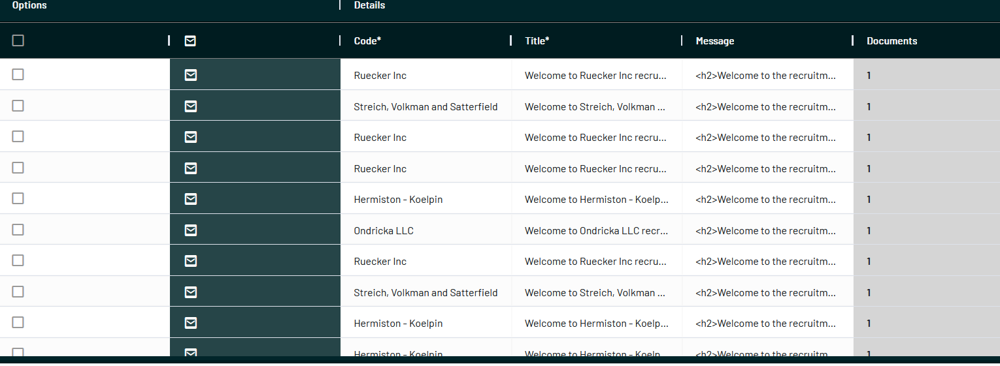
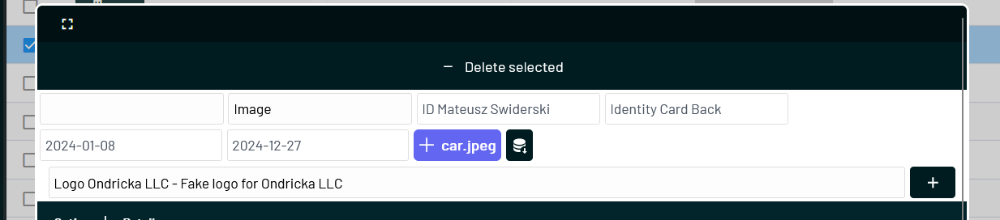
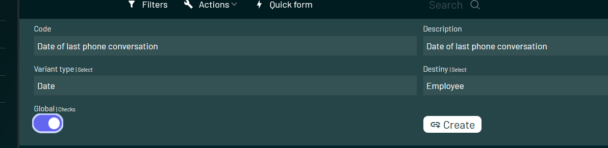
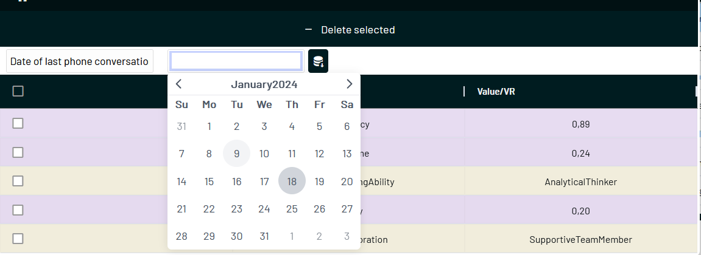

----------------------
-------------------
@Owner and contributor: 
Mateusz Świderski (mateuszss00b@gmail.com)
#### The software is neither licensed nor commercial. It is intended for the development of programming skills. If you wish to use this software, familiarize yourself with the licenses contained in the dependencies.

# Antares 
### Employment Agency System

 
----------------------------

----------------------

This software is designed to streamline the operations of employment agencies, providing tools for managing job listings, candidate profiles, and the overall recruitment process.

Collection and Select Manager solution => ARCH.md

<b>
.NET CORE 8 & VUE 3 OPTIONS API (JS)
</b>

#### v0.0.1

------------------------

### Commits & Tasks:

-------------------------

#8 | 21.01.2024 | Arch1 | Commited

Task Description:
Implemented functionality to assess matches for Variants concerning individual employees, checked positions, recruitment processes, and companies. Introduced separate trackers for employees aligning with specific positions, recruitment processes, and companies seeking employees matching their positions.

Actions Taken:

    Match Assessment for Employees:
        Developed functionality to assess matches for Variants related to individual employees.

    Match Assessment for Checked Positions:
        Implemented the assessment of matches for Variants concerning checked positions within the application.

    Match Assessment for Recruitment Processes:
        Introduced trackers to assess matches for Variants in the context of recruitment processes.

    Match Assessment for Companies and Positions:
        Implemented functionality to assess matches for Variants in the context of companies seeking employees matching their positions.

Next Steps:

    Conduct comprehensive testing of the match assessment functionality for various scenarios to ensure accurate tracking.

Issues:

    No significant issues encountered during the implementation of match assessment for Variants.

#7 | 18.01.2024 | Arch1 | Commited

Task Description:
Added the Recruitment Process to the application, aiming to gather users from a distributed web application implemented through forms and user accounts. By filling in selected Variants marked as global, users can trigger specific forms distinguished by recruitment offers, positions, and companies. Navigating through the entire recruitment process, the system operator can approve or cancel, invoking the assigned function accordingly.

Actions Taken:

    Recruitment Process Implementation:
        Integrated the Recruitment Process, allowing the collection of users through a web application with forms and user accounts.

    Variant Usage for Form Selection:
        Utilized Variants marked as global to invoke specific forms based on recruitment offers, positions, and companies.

    Approval and Cancellation Handling:
        Implemented the functionality for system operators to approve or cancel the recruitment process, triggering the associated functions.

Next Steps:

    Conduct thorough testing of the Recruitment Process and associated form selection functionalities.

Issues:

    No significant issues encountered during the implementation of the Recruitment Process.

#6 | 17.01.2024 | Arch1 | Commited

Task Description:
Implemented the Action Function, Status Functions, and introduced the concept of Status. This implementation enables the creation of functions that involve selecting the appropriate system function, such as Mail, and choosing a trigger. By selecting a StoreModel and a target object, the specified function will be invoked on the corresponding trigger during status changes.

Actions Taken:

    Action Function Implementation:
        Created the Action Function module to handle the execution of system functions based on triggers.

    Status Functions Integration:
        Integrated Status Functions to facilitate the selection and execution of specific functions tied to status changes.

    Status Concept Introduction:
        Introduced the concept of Status, allowing for the categorization and management of different states within the application.

Next Steps:

    Test the implemented Action Function, Status Functions, and Status concepts thoroughly.

Issues:

    No significant issues encountered during the implementation of Action Function, Status Functions, and Status.

#5(a) | 19.01.2024 | Arch1 | Commited

Task Description:
Implemented the StoreModel object for data source segregation, aiming to individualize it for the needs of attached groups, specific tasks, filters, and other implementable and already implemented functionalities.

Actions Taken:

    StoreModel Object Creation:
        Added the StoreModel object to the application architecture to allow for the segregation of data sources.

    Individualization for Attached Groups:
        Customized the StoreModel to cater to the requirements of attached groups, tasks, filters, and other applicable functionalities.

Next Steps:

    Integrate the StoreModel object into the existing functionalities and tasks that require individualized data sources.

Issues:

    No significant issues encountered during the implementation of the StoreModel object for data source segregation.

#5(b) | 20.01.2024 | Arch1 | Commited

Task Description:
Added the Mail Function and introduced Mail objects for storing contextual data and HTML content for scheduled messages. This enhancement facilitates the creation, management, and sending of emails within the application.

Actions Taken:

    Mail Function Implementation:
        Integrated the Mail Function to handle the sending of emails.

    Mail Objects for Context and HTML:
        Introduced Mail objects capable of storing contextual data and HTML content for messages scheduled to be sent.

Next Steps:

    Test the Mail Function and Mail objects thoroughly to ensure seamless email communication within the application.

Issues:

    No significant issues encountered during the implementation of the Mail Function and Mail objects.

#5 | 12.12.2023 | Arch1 | Commited

Task Description:
Implemented file handling functionalities and extended the Collection Manager to enhance collection management capabilities. Additionally, updated existing interfaces responsible for collection management to accommodate the new features.

Actions Taken:

    File Handling:
        Introduced file handling capabilities to allow Collection Managers to import and export data efficiently.

    Collection Manager Extension:
        Enhanced the Collection Manager component to provide advanced features for better collection organization and manipulation.

    Interface Updates:
        Modified existing interfaces related to collection management to include the newly added functionalities.

Next Steps:

    Conduct thorough testing of the file handling and extended Collection Manager functionalities.

Issues:

    No significant issues encountered during the implementation of file handling and Collection Manager extension.

#4 | 11.12.2023 | Arch1 | Commited

Task Description:
Added the variant field into the employee chances calculation logic. Integrated the extended variant field to dynamically calculate and assess an employee's chances for specific positions based on the defined subfields.

Actions Taken:

    Integration of Variant Field:
        Incorporated the extended variant field into the application's employee chances calculation logic.

Next Steps:

    Conduct thorough testing of the employee chances calculation logic with the integrated variant field.

Issues:

    No significant issues encountered during the integration of the variant field into the employee chances calculation logic.
#3 | 10.12.2023 | Arch1 | Commited

Task Description:
Extended the functionality of the variant field to support three subfields: numeric value, date value, and realisation value. The numeric value accepts numerical data, the date value handles date information, and the realisation value accommodates an object of the Variant Realisation type, consisting of parameters code and description. This logic allows for diverse value comparisons, enabling powerful filtering and various other capabilities. In the context of this project, variants are responsible for calculating an employee's chances for a specific position.

Actions Taken:

    Variant Field Enhancement:
        Expanded the variant field to include subfields (numeric value, date value, and realisation value).

    Implementation of Subfields:
        Defined the logic for each subfield to handle numerical, date, and complex realisation values.

Next Steps:

    Integrate the extended variant field into the application logic for calculating employee chances for specific positions.

Issues:

    No significant issues encountered during the implementation of the extended variant field.

#2 | 09.12.2023 | Arch1 | Commited

Task Description:
Implemented enhancements to the application architecture to enable the deletion of individual items and the introduction of a multi-delete feature for grid management. Additionally, added a new field, variant, as an object owned by the main application models. The purpose of this field is to facilitate object filtering and attribute assignment.

Actions Taken:

    Delete and Multi-Delete Functionality:
        Integrated the ability to delete individual items and introduced a multi-delete feature for efficient grid management.

    Variant Field Addition:
        Added a new field, variant, to the main application models (employee and company) to support object filtering and attribute assignment.

Next Steps:

    Extend the functionality of the variant field to allow for dynamic filtering of objects based on specific attributes.

Issues:

    No significant issues encountered during the implementation of delete and multi-delete functionality.

#### #2 | 09.12.2023 | Arch1 | **Commited**

**Task Description:**
Implemented enhancements to the application architecture to enable the deletion of individual items and the introduction of a multi-delete feature for grid management. Additionally, added a new field, `variant`, as an object owned by the main application models. The purpose of this field is to facilitate object filtering and attribute assignment.

**Actions Taken:**
1. **Delete and Multi-Delete Functionality:**
   - Integrated the ability to delete individual items and introduced a multi-delete feature for efficient grid management.

2. **Variant Field Addition:**
   - Added a new field, `variant`, to the main application models (`employee` and `company`) to support object filtering and attribute assignment.

**Next Steps:**
- Extend the functionality of the `variant` field to allow for dynamic filtering of objects based on specific attributes.

**Issues:**
- No significant issues encountered during the implementation of delete and multi-delete functionality.
  ChatGPT
  #2 | 09.12.2023 | Arch1 | Commited

Task Description:
Implemented enhancements to the application architecture to enable the deletion of individual items and the introduction of a multi-delete feature for grid management. Additionally, added a new field, variant, as an object owned by the main application models. The purpose of this field is to facilitate object filtering and attribute assignment.

Actions Taken:

    Delete and Multi-Delete Functionality:
        Integrated the ability to delete individual items and introduced a multi-delete feature for efficient grid management.

    Variant Field Addition:
        Added a new field, variant, to the main application models (employee and company) to support object filtering and attribute assignment. Implemented CollectionManager component enhancements to handle the new variant field.

    CollectionManager Component Enhancements:
        Extended the CollectionManager component to accommodate the variant field, allowing dynamic filtering of objects based on specific attributes. Described and documented the updated component in the arch.md file.

Next Steps:

    Further extend the functionality of the variant field, considering dynamic filtering and attribute assignment based on specific use cases.

Issues:

    No significant issues encountered during the implementation of delete and multi-delete functionality or the addition of the variant field.

------------------------------

#### #1 | 08.12.2023 | Init  | **Commited**
Initiated the project with the goal of setting up the initial CRUD  architecture for the main models, employee and company. The task also involved designing the application's overall structure and implementing preliminary mechanisms essential for navigating the application.
